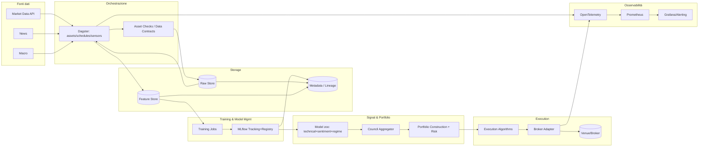
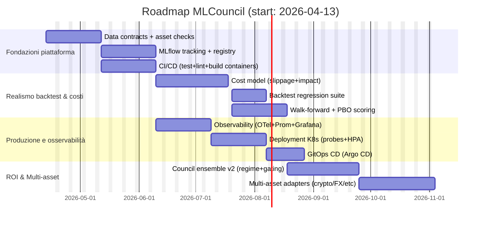

# Analisi tecnica e roadmap end‑to‑end per MLCouncil nell’algotrading

## Sintesi esecutiva

**Contesto e assunzioni (esplicite).** L’analisi assume come mercato target predefinito **azioni USA (US equities)**, senza vincoli di budget, senza requisiti espliciti di latenza (quindi *non* HFT “ultra‑low latency”), e senza cloud provider vincolante. Queste assunzioni sono coerenti con quanto indicato nella richiesta.  

**Tesi centrale.** Il repository *MLCouncil* mostra un’impostazione architetturale “quasi‑piattaforma”: include componenti per ingestione dati, feature engineering, modelli eterogenei, aggregazione/portfolio construction, backtesting, execution e un’API di controllo. Questo lo avvicina più a una *research‑to‑production stack* che a un semplice notebook di trading. Il salto qualitativo necessario per avvicinarsi allo “stato dell’arte” industriale non è tanto (solo) “un modello più complesso”, quanto **un’industrializzazione completa**: data contracts/quality gates, tracciabilità esperimenti, gestione versioni modelli e dataset, backtest robusti anti‑overfitting, modellazione realistica dei costi (slippage/market impact), controlli di rischio e monitoraggio operativo continuo. Queste leve sono anche quelle che, nella pratica, massimizzano il ROI nel medio periodo. citeturn4search0turn4search1turn4search2turn5search1turn0search0

**Cosa il repo fa già bene (highlights).**
- **Orchestrazione dati** orientata a pipeline moderne (integrazione con concetti di orchestrazione come asset/controlli qualità è una direzione coerente con piattaforme moderne). citeturn8search8turn1search7turn5search1  
- Presenza di **modelli eterogenei** (es. NLP finanziario con *FinBERT*, modelli tabellari tipo *LightGBM*, regimi di mercato). *FinBERT* è una baseline forte per sentiment finanziario. citeturn4search10turn1search6  
- Orientamento a **backtesting/event‑driven** (l’integrazione con un motore come *NautilusTrader* è in linea con le best practice operative di parità backtest/live). citeturn8search1turn8search0turn8search3  
- Uso di concetti di **uncertainty/coverage** (conformal prediction) che, se ben calibrati, sono utili per position sizing e controlli del rischio. citeturn6search5turn6search1  

**Gap principali rispetto alle best practice.**
- Mancanza (o non evidenza) di un **Model Registry/lineage** e di experiment tracking “seri” (es. MLflow) per riproducibilità e governance delle promozioni in produzione. citeturn0search0turn0search2  
- **Backtest robustness**: serve una disciplina strutturata contro selection bias e backtest overfitting (CSCV/PBO, holdout temporali, purging/embargo, metriche corrette). L’overfitting da backtest è un rischio strutturale: risultati “troppo belli” degradano spesso OOS. citeturn4search0turn4search1turn4search7  
- **Costi e slippage**: per massimizzare ROI reale bisogna modellare slippage/market impact e integrare execution algorithms (VWAP/TWAP/Implementation Shortfall; modelli tipo Almgren‑Chriss). citeturn4search4turn14search5turn14search1  
- **Osservabilità**: metriche, tracing e alerting di produzione (OpenTelemetry + Prometheus/Grafana) per riconciliazioni, incident response e drift. citeturn10search8turn10search9turn10search3  

**Priorità consigliata (in una riga).** Prima “*governance + data quality + cost modeling + CI/CD*”, poi “*model complexity*”. Questa è la sequenza tipica che massimizza ROI *risk‑adjusted* e riduce failure rate in produzione. citeturn4search0turn5search1turn0search0turn4search4  

**Link operativi principali (repo + fonti).**  
```text
MLCouncil (commit analizzato via connettore GitHub): 396e89042f44f0f75f274279e36f16edffb57458
Repo root: https://github.com/eliobenigni7/MLCouncil/tree/396e89042f44f0f75f274279e36f16edffb57458

File chiave (per verifiche rapide):
- README: https://github.com/eliobenigni7/MLCouncil/blob/396e89042f44f0f75f274279e36f16edffb57458/README.md
- Pipeline runner: https://github.com/eliobenigni7/MLCouncil/blob/396e89042f44f0f75f274279e36f16edffb57458/scripts/run_pipeline.py
- Data pipeline: https://github.com/eliobenigni7/MLCouncil/blob/396e89042f44f0f75f274279e36f16edffb57458/data/pipeline.py
- Ingest market data: https://github.com/eliobenigni7/MLCouncil/blob/396e89042f44f0f75f274279e36f16edffb57458/data/ingest/market_data.py
- Ingest news: https://github.com/eliobenigni7/MLCouncil/blob/396e89042f44f0f75f274279e36f16edffb57458/data/ingest/news.py
- Ingest macro: https://github.com/eliobenigni7/MLCouncil/blob/396e89042f44f0f75f274279e36f16edffb57458/data/ingest/macro.py
- Feature Alpha158: https://github.com/eliobenigni7/MLCouncil/blob/396e89042f44f0f75f274279e36f16edffb57458/data/features/alpha158.py
- Target/labeling: https://github.com/eliobenigni7/MLCouncil/blob/396e89042f44f0f75f274279e36f16edffb57458/data/features/target.py
- Store ArcticDB: https://github.com/eliobenigni7/MLCouncil/blob/396e89042f44f0f75f274279e36f16edffb57458/data/store/arctic_store.py
- Retraining: https://github.com/eliobenigni7/MLCouncil/blob/396e89042f44f0f75f274279e36f16edffb57458/data/retraining.py
- Council aggregator: https://github.com/eliobenigni7/MLCouncil/blob/396e89042f44f0f75f274279e36f16edffb57458/council/aggregator.py
- Portfolio construction: https://github.com/eliobenigni7/MLCouncil/blob/396e89042f44f0f75f274279e36f16edffb57458/council/portfolio.py
- Conformal sizing: https://github.com/eliobenigni7/MLCouncil/blob/396e89042f44f0f75f274279e36f16edffb57458/council/conformal.py
- Monitoring/alerts: https://github.com/eliobenigni7/MLCouncil/blob/396e89042f44f0f75f274279e36f16edffb57458/council/monitor.py
- Alerts: https://github.com/eliobenigni7/MLCouncil/blob/396e89042f44f0f75f274279e36f16edffb57458/council/alerts.py
- Model tecnico: https://github.com/eliobenigni7/MLCouncil/blob/396e89042f44f0f75f274279e36f16edffb57458/models/technical.py
- Model sentiment: https://github.com/eliobenigni7/MLCouncil/blob/396e89042f44f0f75f274279e36f16edffb57458/models/sentiment.py
- Regime model: https://github.com/eliobenigni7/MLCouncil/blob/396e89042f44f0f75f274279e36f16edffb57458/models/regime.py
- Backtest runner: https://github.com/eliobenigni7/MLCouncil/blob/396e89042f44f0f75f274279e36f16edffb57458/backtest/runner.py
- Strategy: https://github.com/eliobenigni7/MLCouncil/blob/396e89042f44f0f75f274279e36f16edffb57458/backtest/strategy.py
- Execution adapter Alpaca: https://github.com/eliobenigni7/MLCouncil/blob/396e89042f44f0f75f274279e36f16edffb57458/execution/alpaca_adapter.py
- API: https://github.com/eliobenigni7/MLCouncil/blob/396e89042f44f0f75f274279e36f16edffb57458/api/main.py
- Docker compose: https://github.com/eliobenigni7/MLCouncil/blob/396e89042f44f0f75f274279e36f16edffb57458/docker-compose.yml
```  

---

## Cosa fa MLCouncil oggi

### Executive summary
MLCouncil appare strutturato come **sistema modulare** per costruire segnali da fonti diverse (prezzi, news, macro), trasformarli in feature (incluse librerie “standard” come Alpha158), addestrare modelli eterogenei (tabular + NLP + regime), aggregare segnali a livello di “council”, poi costruire un portafoglio e, potenzialmente, eseguire ordini tramite un adapter broker (Alpaca). La presenza di un’API suggerisce l’intenzione di operare come servizio controllabile e osservabile.

### Risultati dettagliati
**Mappa funzionale (dai file chiave).**
- **Ingestione**: moduli dedicati per market data, news e macro (cartella `data/ingest/`). Per US equities l’uso di un provider come entity["company","Alpaca","broker and market data api"] è coerente: offre accesso a dati storici e real‑time via HTTP/WebSocket e richiede autenticazione (eccetto alcune aree come crypto storica), con indicazioni chiare sulle intestazioni e i flussi auth. citeturn8search5turn8search7  
- **Storage**: presenza di `data/store/arctic_store.py` indica un’intenzione di persistenza “research‑grade” per time series, coerente con entity["company","ArcticDB","timeseries database"] (e/o predecessore Arctic). ArcticDB è posizionato proprio per workflow quantitativi su dataframe/time series scalabili. citeturn5search2turn5search3  
- **Feature engineering**: `data/features/alpha158.py` e `target.py` suggeriscono un pipeline “alpha/labeling”. L’uso di un set di feature standardizzato riduce il rischio di reinventare indicatori base e facilita benchmarking. Tuttavia il “labeling” è spesso il punto più delicato (leakage/overfitting). citeturn6search7turn4search0  
- **Modelli**: file `models/technical.py`, `models/sentiment.py`, `models/regime.py`.  
  - *LightGBM* è una scelta industriale forte per dataset tabellari ad alta dimensionalità/rumore; la paper originale descrive le ottimizzazioni (GOSS, EFB) che lo rendono efficiente e scalabile. citeturn1search6  
  - *FinBERT* è un baseline noto per sentiment finanziario: modello BERT pre‑addestrato/ri‑adattato al dominio finance, utile per news/sentiment factor. citeturn4search10  
  - Modelli di regime (es. HMM) sono tipici per pesare strategie/sorgenti in base al contesto di mercato; l’approccio è coerente con best practice (regime switching).  
- **Aggregazione e portfolio**: cartella `council/` (aggregator, portfolio, conformal, monitor, alerts). L’idea “council” è un’implementazione concreta di **ensemble** e “decision aggregation” (diversi modelli votano/propongono segnali). Questo è spesso più robusto di un singolo modello “monolitico”.  
- **Backtesting**: `backtest/runner.py` e `strategy.py`. Se il backtest è costruito sopra strumenti event‑driven “production grade” (es. entity["organization","NautilusTrader","open-source trading platform"]), è un punto molto positivo perché consente parità tra backtest e live e include concetti chiave (latency model, fill modeling, account types). citeturn8search1turn8search3  
- **Execution**: `execution/alpaca_adapter.py`. Per un broker API come Alpaca, la documentazione chiarisce capacità e protocolli. Per real‑time trading (non HFT) è una base sensata. citeturn8search7turn3search0  
- **API/Control plane**: presenza di `api/main.py` e routers/services suggerisce un “control plane” per lanciare pipeline, leggere configurazioni, monitorare e inviare ordini. Per la parte ASGI/serving, la guida entity["organization","Uvicorn","ASGI server"] evidenzia pattern di deployment e gestione processi. citeturn9search0  
- **Infra locale**: `docker-compose.yml` indica stack multi‑container (tipicamente utile per orchestrator + DB + api). Docker Compose è lo standard de facto per dev/test di stack multi‑servizio. citeturn11search0turn11search2  

### Raccomandazioni azionabili
1. **Rendere esplicito il “contratto” dei dati** (schema, frequenza, timezone, calendar, corporate actions) e legarlo a controlli automatici (asset checks). Dagster fornisce direttamente l’astrazione di asset e asset checks per integrare qualità/monitoraggio nel ciclo di vita dei dati. citeturn1search7turn5search1  
2. **Normalizzare la separazione “research vs production”**: un unico pacchetto condiviso (feature, labeling, cost model, execution model) + configurazioni isolate per ambienti (dev/staging/prod).  
3. **Aggiungere lineage e versioning formale** per dataset/feature/modelli (tracking + registry).

### Checklist prioritaria
1. Definire dataset e feature “golden” (schema + calendario + orari + corporate action policy).  
2. Inserire asset checks su ingest/feature (null/outlier/freshness). citeturn5search1  
3. Stabilire una convenzione di versionamento: `data_version`, `feature_version`, `model_version`.  
4. Separare ambienti (dev/staging/prod) a livello di config e secrets.  
5. Documentare l’interfaccia del council (input/output, confidence, fallback).

---

## Stato dell’arte dell’algotrading e confronto con MLCouncil

### Executive summary
Lo stato dell’arte moderno in algotrading non è dominato da “un singolo modello SOTA”, ma da **stack completi** che combinano: (i) pipeline dati affidabili, (ii) ricerca riproducibile con validazioni anti‑overfitting, (iii) orchestrazione e osservabilità, (iv) backtesting realistico e execution cost‑aware, (v) controllo del rischio e compliance. MLCouncil è **strutturalmente allineato** (ha molti blocchi), ma deve consolidare *governance, robustness statistica e cost/execution modeling* per competere con best practice.

### Risultati dettagliati
**Paradigmi SOTA (ricerca + industria).**
- **Piattaforme AI‑oriented per il ciclo quant completo**: entity["company","Microsoft","technology company"] propone entity["organization","Qlib","quant investment platform"] come piattaforma per workflow AI‑driven in quant investing, enfatizzando infrastruttura e pipeline (ricerca→produzione) e sfide specifiche del dominio finanziario. citeturn1search9  
- **Feature, labeling e meta‑labeling**: entity["people","Marcos López de Prado","quant researcher"] insiste su come il labeling (es. *triple‑barrier method*) e la corretta costruzione dei target siano centrali e spesso sottovalutati. citeturn6search7  
- **Robustezza contro backtest overfitting**: Bailey et al. mostrano che l’ottimizzazione di strategie su backtest può produrre performance elevate in‑sample con alta probabilità di degradazione out‑of‑sample, e propongono CSCV/PBO come framework quantitativo. Questo influenza direttamente come valutare qualsiasi repo/strategia. citeturn4search0turn4search1  
- **Modelli ML tabellari efficienti**: LightGBM rimane un pilastro per segnali tabellari (GBDT) grazie a ottimizzazioni di training e scaling. citeturn1search6  
- **NLP finanziario**: FinBERT è un riferimento per sentiment su testi finanziari con fine‑tuning ridotto e risultati competitivi. citeturn4search10  
- **RL e Transformer**: la ricerca continua a esplorare DRL e modelli Transformer per forecasting/decision‑making; tuttavia la letteratura evidenzia limiti pratici (stazionarietà, risk constraints, costi, stabilità). Un survey DRL sottolinea strutture e problemi ricorrenti; lavori recenti confrontano Transformer vs modelli classici su return forecasting. citeturn9search3turn9search5  
- **Execution e market impact**: il modello di entity["people","Robert Almgren","researcher"] e entity["people","Neil Chriss","researcher"] formalizza il tradeoff tra costi di esecuzione e rischio (volatilità), fondante per execution algorithms (TWAP/VWAP/IS e varianti). citeturn4search4turn4search2  
- **Uncertainty e conformal prediction**: i metodi conformal forniscono garanzie di copertura sotto assunzioni i.i.d., utili per trasformare output ML in decisioni con “confidence sets” e per controllare il rischio di errore. citeturn6search5turn6search1  

**Confronto MLCouncil vs best practice (tabella).**  
> Nota: “Presente” significa identificabile dal codebase/struttura; “Da rafforzare” indica assenza di evidenza di una soluzione completa (o componente minima).  

| Area | Best practice SOTA | Stato attuale in MLCouncil (evidenza da struttura file) | Gap / rischio | Priorità |
|---|---|---|---|---|
| Orchestrazione | Asset‑oriented, lineage, checks, retry, schedules | Presenza di integrazione/orchestrazione (client/stack) | Rendere asset checks e data contracts “first‑class” | Alta citeturn8search8turn5search1 |
| Data quality | Check di freshness, nulls, outlier; pipeline gating | Moduli ingest/feature presenti | Senza quality gates, si propagano errori “silenziosi” | Alta citeturn5search1 |
| Experiment tracking | Tracciare run, parametri, dataset, metriche | Non evidente | Impossibile audit e riproducibilità robusta | Alta citeturn0search0 |
| Model registry | Versioning + promotion controllata | Non evidente | Rischio “shadow deployments” e rollback difficile | Alta citeturn0search0turn0search2 |
| Backtest robustness | Anti‑overfitting (CSCV/PBO), OOS rigoroso | Backtest presente | Senza PBO/selection‑bias control ROI illusorio | Alta citeturn4search0turn4search7 |
| Execution cost model | Slippage/impact + latency model | Adapter broker presente; cost model non evidente | PnL reale << backtest | Alta citeturn4search4turn14search5 |
| Ensemble | Aggregazione robusta di segnali | “Council” presente | Raffinare weighting, gating, regime switching | Media |
| Monitoring | Metrics, tracing, alerting, reconciliation | Monitor/alerts presenti | Standardizzare su OpenTelemetry/Prometheus | Media citeturn10search8turn10search9 |
| Compliance | Controlli e resilienza sistemi, test e limiti | Non evidenza end‑to‑end | Richiesti controlli per algotrading in EU | Media/Alta citeturn7search0 |

### Raccomandazioni azionabili
1. Adottare **valutazione “anti‑PBO”** come criterio di accettazione di nuove strategie/modelli (PBO, deflated Sharpe, walk‑forward). citeturn4search0turn4search7  
2. Integrare un **cost model** “realistico” (slippage, latency, market impact) e rendere il backtest “cost‑aware” come default. citeturn4search4turn14search5turn8search1  
3. Rendere “first‑class” un **Model Registry**: staging → prod con guardrail e rollback. citeturn0search0turn0search2  
4. Per NLP/news: passare da “sentiment puro” a **signal engineering** con validazioni temporali e leakage prevention.

### Checklist prioritaria
1. Definire protocollo OOS: split temporali + walk‑forward + PBO. citeturn4search0  
2. Inserire transaction cost model (+ stress su spread) nel backtest. citeturn4search4turn14search5  
3. Implementare MLflow tracking + registry per ogni training. citeturn0search0  
4. Formalizzare ensemble: regole di gating e pesi per regime.  
5. Soglie di rischio e circuit breakers in execution (EU‑style controls). citeturn7search0  

---

## Automazione end‑to‑end e architettura target

### Executive summary
Per “automatizzare completamente” MLCouncil serve passare da pipeline eseguibili manualmente a **sistema auto‑operante** con: orchestrazione (schedule/sensor), qualità dati (asset checks), tracking e registry, backtest automatici prerelease, deployment e rollout controllati, execution con controlli di rischio, e monitoring/alerting su produzione. Dagster + MLflow + containerizzazione + CI/CD (GitHub Actions) + osservabilità (OpenTelemetry/Prometheus/Grafana) è una combinazione standard e coerente. citeturn8search8turn5search1turn0search0turn11search1turn10search8turn10search9  

### Risultati dettagliati
**Componenti di automazione (target state) e come si incastrano.**

| Componente | Cosa deve fare “in produzione” | Tecnologie consigliate (primarie) | Perché |
|---|---|---|---|
| Ingestione dati | Fetch/streaming, dedup, retry, backfill, calendar aware | Dagster assets + schedules/sensors citeturn8search8 | Orchestrazione asset‑centric, lineage/observability |
| Validazione dati | Gate su qualità: null/outlier/freshness/schema | Dagster Asset Checks citeturn5search1 | Quality integrata in orchestrazione |
| Data store | Time series store “research+prod” | ArcticDB (o Parquet+catalog) citeturn5search3 | Query time‑series e workflow quant |
| Feature store | Persistenza feature + versioning | ArcticDB + metadata | Riduce training‑serving skew |
| Training | Training riproducibile, parametrizzato, schedulato | Dagster + MLflow tracking citeturn0search0turn8search8 | Automated runs + logging |
| Model Registry | Promozione champion/challenger, rollback | MLflow Model Registry citeturn0search0 | Versioning, lineage, governance |
| Backtesting | Regressioni su strategie, cost model | NautilusTrader backtest engine citeturn8search1 | Parità backtest/live, fill modeling, latency |
| Serving/API | Trigger pipeline, query stati, governance | ASGI server deployment (Uvicorn/Gunicorn patterns) citeturn9search0 | Deployment standard |
| Execution | Ordini, routing, reconciliation | Broker API + exec algos | È dove “muore” il PnL se mal fatto |
| Monitoring | Metriche/trace/log + alerting | OpenTelemetry + Prometheus/Grafana citeturn10search8turn10search9turn10search3 | Incident response e drift |
| CI/CD | Test, build immagini, deploy controllato | GitHub Actions citeturn11search1 | Standard CI/CD integrato repo |
| Infra | Deploy replicabile, autoscale, health probes | Kubernetes (probes + autoscaling) citeturn12search1turn13search0 | Resilienza e scalabilità |
| IaC/GitOps | Provision + CD dichiarativo | Terraform + Argo CD citeturn13search2turn12search4 | Reproducibility e audit |

**Architettura target (Mermaid).**  

citeturn8search8turn5search1turn0search0turn10search8turn10search9  

**Nota compliance/controlli (rilevante se operi in EU o con requisiti simili).** L’art. 17 di MiFID II richiede sistemi e controlli efficaci, resilienza, limiti/soglie, prevenzione di ordini erronei, business continuity e testing/monitoring dei sistemi. Anche se l’obiettivo iniziale è US equities retail/proprietary, adottare controlli “EU‑grade” riduce rischio operativo. citeturn7search0  

### Raccomandazioni azionabili
1. Trasformare ingest/feature/training in **Dagster assets** con policy di scheduling e backfill; aggiungere asset checks bloccanti. citeturn8search8turn5search1  
2. Introdurre **MLflow** per tracking e registry (champion/challenger), con gate automatici basati su metriche OOS e stress test. citeturn0search0turn0search2  
3. Standardizzare **osservabilità** con OpenTelemetry per logs/metrics/traces e pipeline di metriche verso Prometheus/Grafana. citeturn10search8turn10search9turn10search3  
4. Rendere CI/CD obbligatorio: test unitari + “backtest regression suite” + build container su ogni PR (GitHub Actions). citeturn11search1  

### Checklist prioritaria
1. Definire “golden path” Dagster: ingest→checks→feature→train→register→backtest→deploy. citeturn8search8turn5search1  
2. Implementare MLflow tracking+registry; policy di promotion automatica. citeturn0search0  
3. Containerizzare i servizi e usare Compose per dev parity; poi K8s per prod. citeturn11search0turn12search1  
4. Observability baseline (OTel + Prometheus + dashboard). citeturn10search8turn10search9  
5. Circuit breakers e risk limits (anche se non richiesti). citeturn7search0  

---

## Leve per massimizzare il ROI: metodi concreti

### Executive summary
Massimizzare ROI in algotrading significa massimizzare **ROI “netto e risk‑adjusted”**: dopo costi (commissioni, spread, slippage) e sotto vincoli di rischio (drawdown, exposure, tail risk). Le leve più efficaci sono: (i) selezione/validazione strategie anti‑overfitting, (ii) portfolio construction robusta e risk budgeting, (iii) cost model + execution algos, (iv) tuning e ensemble con discipline statistiche, (v) monitoraggio e kill‑switch. citeturn4search0turn4search4turn14search5turn8search1  

### Risultati dettagliati
#### Selezione strategie: evitare ROI “illusorio”
- **Misurare e penalizzare selection bias/backtest overfitting**: adottare CSCV/PBO e (se possibile) metriche corrette tipo deflated Sharpe ratio. L’idea chiave: se provi molte configurazioni, la probabilità di trovare “un vincitore” spurio cresce rapidamente. citeturn4search0turn4search7  
- **Labeling robusto**: usare metodi come *triple‑barrier* per definire target coerenti con stop/take profit e orizzonte temporale. citeturn6search7  
- **Regime awareness**: mantenere strategie specializzate per regime e un meta‑controller che decide l’allocazione (coerente con l’idea “council”).  

#### Portfolio construction e risk management
- **Vincoli e budget di rischio**: vol targeting, max drawdown guardrails, limiti per settore/singolo titolo, exposure net/gross, leverage control, stop di portafoglio.  
- **Uncertainty‑aware sizing**: conformal prediction può trasformare output in decisioni con coverage garantita (sotto assunzioni), utile per definire size in funzione della “credibility/confidence”. citeturn6search5turn6search1  
- **Riconciliazione e controlli operativi**: la normativa EU richiede soglie, limiti e prevenzione ordini erronei; anche fuori EU, questi controlli riducono rischio di blow‑up. citeturn7search0  

#### Transaction costs, slippage e market impact: la leva più sottovalutata
- **Execution cost model**: il modello Almgren‑Chriss formalizza la frontiera efficiente tra costo atteso e rischio, e introduce concetti come L‑VaR. Questo è direttamente applicabile per scegliere aggressività/tempo di esecuzione. citeturn4search4turn4search2  
- **Slippage modeling “engine‑level”**:  
  - Esempi pratici includono modelli a basis points + volume limits (Zipline) citeturn14search5  
  - oppure slippage percentuale/fisso e regole di match (Backtrader). citeturn14search0  
  - In ambienti più completi (QuantConnect/LEAN) esistono modelli predefiniti incluso “market impact model”, con riferimento esplicito a letteratura di impatto. citeturn14search1  
- **Implicazione pratica**: integrare questi costi nel backtest e nella funzione obiettivo evita che l’ottimizzatore “spinga” su turnover eccessivo.

#### Hyperparameter tuning ed ensemble
- **Tuning disciplinato**: mai ottimizzare su un singolo periodo; fare walk‑forward e validazione temporale. Misurare PBO per tuning massivo. citeturn4search0  
- **Ensemble “council”**: meglio combinare modelli con gating e pesi dinamici che puntare a un unico SOTA instabile. (La ricerca su DRL/Transformer continua, ma la produzione privilegia robustezza e controllabilità.) citeturn9search3turn9search5  

#### Execution algorithms (pratico)
- Per US equities via broker API: implementare **TWAP/VWAP/Implementation Shortfall** con parametri calcolati su liquidità e volatilità; usare latenza/riempimenti realistici nel backtest. NautilusTrader documenta esplicitamente latency model e fill modeling philosophy. citeturn8search1turn4search4  

**Tabella: leve ROI → azione concreta nel codebase.**

| Leva ROI | Problema tipico | Metodo concreto | Implementazione consigliata (template) | Evidenza/razionale |
|---|---|---|---|---|
| Anti‑overfitting | “Sharpe backtest” non regge | PBO/CSCV + deflated SR | Suite di valutazione OOS automatica | citeturn4search0turn4search7 |
| Costi | Turnover alto “finto profitto” | Slippage+impact model | Libreria cost_model + integrazione backtest | citeturn4search4turn14search5 |
| Execution | Fill irrealistici | TWAP/VWAP/IS | ExecAlgorithm layer + simulazione latenza | citeturn8search1turn4search4 |
| Risk mgmt | Drawdown e tail risk | Vol targeting + limits | Risk engine prima di inviare ordini | citeturn7search0 |
| Uncertainty | Size troppo aggressiva | Conformal sizing | “confidence→size” con coverage | citeturn6search5 |
| Ensemble | Instabilità modello singolo | Council + regime weights | Pesi dinamici per regime | citeturn1search9 |
| NLP/news | Rumore e bias | FinBERT + leakage control | Timestamp‑safe pipeline + ablation | citeturn4search10 |

### Raccomandazioni azionabili
1. Inserire nel pipeline un **Transaction Cost & Slippage Layer** con parametri calibrabili per simbolo (spread, ADV, volatilità). citeturn14search5turn14search1  
2. Standardizzare la selezione strategie con **PBO/CSCV** e rifiutare strategie con segnali di selection bias. citeturn4search0  
3. Implementare execution algos “base” (TWAP/VWAP/IS) e testare in backtest con latenza e fill models. citeturn8search1turn4search4  
4. Rendere il “council” un **ensemble disciplinato**: stacking con fallback + gating per regime + penalità turnover.

### Checklist prioritaria
1. Aggiungere cost model (slippage/commission/impact) in backtest e live. citeturn14search5turn4search4  
2. Implementare protocollo PBO per tuning e selezione. citeturn4search0  
3. Inserire guardrail di rischio e kill‑switch automatici. citeturn7search0  
4. Exec algos minimi + test di latenza/fill. citeturn8search1  
5. “Champion/challenger” con registry e rollout graduale. citeturn0search0  

---

## Roadmap tecnica con milestone, timeline, risorse e deliverable

### Executive summary
Una roadmap efficace separa: (i) **fondazioni di piattaforma** (data quality, tracking, CI/CD), (ii) **backtest+cost modeling** (realismo), (iii) **deployment+observability** (operazioni), (iv) **ottimizzazione ROI** (strategie/ensemble), (v) **multi‑asset expansion**. Con budget non vincolato, la limitazione reale è la capacità del team e la disciplina di validazione.  

### Milestone e deliverable (pratici)
**Risorse minime consigliate (FTE):**
- 1 Quant Researcher (strategie + validazione statistica)
- 1 ML Engineer (training, feature pipeline, MLflow)
- 1 Data/Platform Engineer (Dagster, storage, data quality)
- 1 DevOps/SRE (CI/CD, osservabilità, deploy, sicurezza)
- 0.5 QA/Engineer (test harness, backtest regression suite)

**Timeline indicativa (24 settimane)**  

citeturn5search1turn0search0turn11search1turn4search0turn10search8turn12search1turn13search0turn12search4  

### Cosa consegnare a ogni fase (deliverable “verificabili”)
**Fondazioni piattaforma**
- “Data contract spec” (schema + calendari + frequenze + policy corporate actions) + suite di asset checks in orchestratore. citeturn5search1turn1search7  
- MLflow server (tracking + registry) con convenzioni: naming, tagging, lineage, champion alias. citeturn0search0turn0search2  
- Pipeline CI/CD con GitHub Actions: unit test + smoke test + build/push immagini. citeturn11search1  

**Realismo backtest & costi**
- Libreria `cost_model` (slippage, commissioni, spread, market impact) con parametri calibrabili; integrazione in backtest. citeturn4search4turn14search5turn14search1  
- Backtest regression suite: test “golden” su strategie con output deterministico (dati e seed fissati). citeturn8search1  
- Valutazione automatica: walk‑forward + PBO score e soglie di promozione. citeturn4search0  

**Produzione e osservabilità**
- Telemetria end‑to‑end: traces su pipeline+execution; metriche su PnL, fill rate, latency, drift; dashboard standard e alert policy. citeturn10search8turn10search3turn10search9  
- Deploy su K8s con readiness/liveness e autoscaling per servizi non‑latency‑critical. citeturn12search1turn13search0  
- CD GitOps con Argo CD (audit trail e rollback). citeturn12search4turn12search0  

### Raccomandazioni azionabili
1. Definire un **“Definition of Done” quantitativo** per promozioni: OOS Sharpe, max drawdown, turnover, PBO e stress su costi. citeturn4search0turn4search7turn14search5  
2. Rendere “non negoziabili” asset checks e MLflow logging: senza, non entra nulla in produzione. citeturn5search1turn0search0  
3. Mettere in roadmap un “**kill‑switch**” e controlli stile MiFID/Art.17 anche se non richiesti. citeturn7search0  

### Checklist prioritaria
1. Asset checks + data contracts. citeturn5search1  
2. MLflow tracking + registry. citeturn0search0  
3. Cost model integrato nel backtest. citeturn4search4turn14search5  
4. CI/CD + backtest regression suite. citeturn11search1turn8search1  
5. Observability + alerting + rollback deploy. citeturn10search8turn12search4  

---

## Adattamento ad altre asset class

### Executive summary
MLCouncil può essere esteso a crypto, FX, futures, options e fixed income se si separano chiaramente: **data adapters**, **instrument model** (tick size, sessioni, margini, corporate actions), **risk model** (leverage e margining), e **execution adapters** (venue‑specific). Adottare un motore/event model asset‑class‑agnostic (es. NautilusTrader) accelera l’estensione, purché i dataset e i modelli rispettino le peculiarità microstrutturali. citeturn8search3turn8search1turn8search5  

### Risultati dettagliati
#### Crypto
**Dati necessari**
- OHLCV + order book (se si fa execution più fine) + funding/derivatives se si opera su perp/futures crypto.  
- Mercato 24/7, assenza di “session close” tradizionale → feature e risk devono gestire weekend e gap diversi da equities.

**Modifiche ai modelli**
- Maggior peso a volatilità e microstruttura; modelli regime switching spesso più importanti.  
- NLP: news crypto spesso rumorose → serve robustezza e filtri.

**Execution**
- API exchange (REST/WebSocket). Alpaca supporta anche crypto data/streaming e menziona eccezioni di auth per dati storici crypto. citeturn8search5turn3search0  
- Latency e fill modeling: usare engine che gestisce latency model e fill philosophy in backtest. citeturn8search1  

#### FX
**Dati necessari**
- Tick/quote (bid/ask) e calendari forex; attenzione a rollover e sessioni globali.  

**Modifiche ai modelli**
- Feature basate su carry, volatility regime, macro e risk‑on/off più rilevanti.  

**Execution**
- Venue specifica (prime broker/aggregator); slippage e spread sono centrali. Modelli di slippage (basis points + volume) sono un baseline. citeturn14search5turn14search0  

#### Futures
**Dati necessari**
- Serie continue con **roll logic** (front/next), open interest, curve, calendar spread.  

**Modifiche ai modelli**
- Necessaria modellazione di margini e leverage; segnali spesso dipendono da term structure e roll yield.

**Execution**
- Accounting “margin” e gestione leverage. NautilusTrader distingue account types (cash vs margin) e questo è un punto pratico per futures. citeturn8search1  

#### Options
**Dati necessari**
- Chain completa (strike/expiry), bid/ask, Greeks, implied volatility surface.  

**Modifiche ai modelli**
- Output spesso non è “buy/sell underlying” ma costruzione di strategie (spreads, hedging delta/gamma).  
- Costruzione target e risk model molto diversi (tail exposures).

**Execution**
- Richiede supporto a order types e gestione multi‑leg; broker API deve supportare opzioni (roadmap provider‑specific). citeturn8search7  

#### Fixed income
**Dati necessari**
- Curve, yields, spreads, quote spesso OTC e meno trasparenti.  

**Modifiche ai modelli**
- Fattori macro e curve modeling dominanti; liquidità scarsa → cost model più aggressivo.

**Execution**
- Più complessa (OTC, RFQ, venues specializzate), più attenzione a market impact e limiti rischio.

### Raccomandazioni azionabili
1. Estrarre interfacce “core” astratte: `DataAdapter`, `InstrumentSpec`, `ExecutionAdapter`, `CostModel`, `RiskModel`.  
2. Rendere il backtest **asset‑class configurable** (calendar, account type, tick size). NautilusTrader enfatizza asset‑class agnostic e modular adapters, utile come pattern. citeturn8search3  
3. Per ogni nuova asset class, definire un “**Minimum Viable Dataset**” e una suite di sanity checks (dagster asset checks). citeturn5search1  
4. Aumentare peso di cost model e execution quando la microstruttura è più complessa (options/fixed income). citeturn4search4turn14search5  

### Checklist prioritaria
1. Interfacce astratte per adapters e strumenti.  
2. Calendar+session model per asset class (equities vs 24/7).  
3. Cost model per asset class (spread/slippage/impact). citeturn14search5  
4. Backtest config: account type cash/margin dove serve. citeturn8search1  
5. Execution adapter e reconciliation per ogni venue.

---

```text
Fonti chiave (selezione, primarie/ufficiali quando disponibili):
- Qlib (Microsoft Research): https://www.microsoft.com/en-us/research/publication/qlib-an-ai-oriented-quantitative-investment-platform-2/
- LightGBM paper (NeurIPS/NIPS PDF): https://papers.nips.cc/paper/6907-lightgbm-a-highly-efficient-gradient-boosting-decision-tree.pdf
- MLflow Model Registry (docs): https://mlflow.org/docs/latest/ml/model-registry/
- Dagster (getting started + asset checks): https://docs.dagster.io/getting-started ; https://release-1-8-9.dagster.dagster-docs.io/concepts/assets/asset-checks/define-execute-asset-checks
- Conformal prediction tutorial (JMLR): https://jmlr.csail.mit.edu/papers/v9/shafer08a.html
- Backtest Overfitting (SSRN Bailey et al.): https://papers.ssrn.com/sol3/papers.cfm?abstract_id=2326253
- Almgren-Chriss execution (Risk.net): https://www.risk.net/journal-of-risk/technical-paper/2161150/optimal-execution-portfolio-transactions
- NautilusTrader docs: https://nautilustrader.io/docs/latest/concepts/backtesting
- OpenTelemetry docs: https://opentelemetry.io/docs/
- Kubernetes probes/autoscaling: https://kubernetes.io/docs/concepts/configuration/liveness-readiness-startup-probes/ ; https://kubernetes.io/docs/concepts/workloads/autoscaling/horizontal-pod-autoscale/
- ESMA MiFID II Art. 17: https://www.esma.europa.eu/publications-and-data/interactive-single-rulebook/mifid-ii/article-17-algorithmic-trading
```
