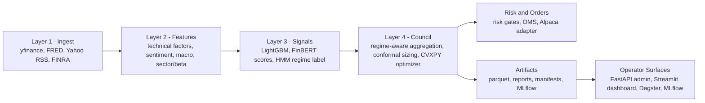
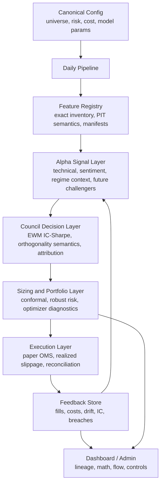

# MLCouncil AS IS / TO BE Concept

Source: `E:\Desktop\Sviluppo\MLCouncil_Combined_Analysis.pdf`, extracted and checked against the current repository on 2026-05-21.

## Executive Position

MLCouncil is not a simple research notebook. It is already a batch-first paper-trading platform with Dagster orchestration, FastAPI control plane, Streamlit dashboard, MLflow tracking, artifact governance, runtime profiles, pre-trade controls, and Alpaca paper execution.

The core problem is no longer "build the system". The core problem is alignment: documentation, code, config, math claims, and operator surfaces must describe the same system. The TO BE should therefore be built in two phases:

1. Foundation cleanup: close AS IS mismatches that affect auditability, risk, and statistical transparency.
2. Advanced evolution: introduce higher-order alpha, aggregation, portfolio, execution, and observability features only after a clean baseline exists.

Dashboard redesign is intentionally not specified here. It should be brainstormed after this documentation/prompt package is reviewed, because the dashboard deserves its own product/design discussion.

## AS IS Inventory

Operationally, the daily path is:

1. Ingest OHLCV, macro, news.
2. Compute lookahead-safe technical features and sentiment features.
3. Load/checkpoint models for inference.
4. Produce LightGBM and sentiment signals.
5. Use HMM as regime label, not as a daily alpha signal.
6. Aggregate active signals with regime-aware weights and adaptive IC-Sharpe logic.
7. Apply conformal sizing.
8. Optimize target weights with CVXPY.
9. Gate through risk checks.
10. Emit orders and support paper execution.

## Current Drift Register

| ID | Area | Current mismatch | Severity | Target decision |
|---|---|---|---|---|
| M1 | Feature naming | `Alpha158` branding suggests a fuller Qlib-style feature set than the actual inventory. | Low | **Resolved (2026-05-21):** module documents Alpha158-inspired inventory; use `alpha158_feature_count()` for exact runtime factor count (~60, not 158). |
| M2 | Portfolio/risk docs | README risk constraints drift from code values such as `max_vol_ann=0.30`, dynamic sector cap around `0.35`, beta neutrality, and cash reserve behavior. | High | **Resolved:** README risk-table block is auto-generated by `scripts/generate_risk_doc.py` (idempotent, runs against live `PortfolioConstructor` defaults + `runtime.env`); rerun any time config changes. |
| M3 | Universe docs | README still describes a smaller 19-equity universe, while `config/universe.yaml` now has a broader equity set plus BTCUSD/ETHUSD. | High | **Resolved:** README "Asset Universe" section documents the 26+6+2 bucket structure with per-ticker caps and distinguishes research vs trading universe via `load_universe_as_of()`. |
| M4 | Parkinson volatility | The feature uses mean squared log high/low range without the canonical `1 / (4 ln 2)` scale factor. | Medium | **Resolved (2026-05-21):** `park_vol_20d` applies canonical Parkinson variance scaling `1/(4 ln 2)`. |
| M5 | Council IR naming | Docs/docstrings say rolling 100-day IR; implementation uses EWM IC-Sharpe with halflife up to 20 over recent history. | Medium | **Resolved:** README (139, 280) describes EWM IC-Sharpe; `council/aggregator.py` module docstring updated; AGENTS.md mandates correct wording for agents. |
| M6 | Orthogonality penalty | Council weights are intentionally not renormalized after orthogonality downweighting, then the combined signal is z-scored. | Medium | **Resolved (2026-05-21):** option 1 confidence shrinkage — `weight_sum` may be &lt; 1; exposed in `_weights_log` and attribution as `effective_weight_sum`. |
| M7 | Sentiment source weighting | Source credibility weighting exists conceptually, but the daily `sentiment_features` path averages headline scores per ticker. | Medium | **Resolved (2026-05-21):** daily `sentiment_features` uses `SentimentModel.aggregate_scored_headlines()` with source/recency weights. |
| M8 | Target engineering | Daily docs imply target engineering in inference, but targets belong to training/backtesting. | Low | **Resolved:** `docs/data-flow-daily-vs-training.md` contains two Mermaid diagrams making the boundary explicit; daily Dagster path does not call `compute_targets`. |
| M9 | Transaction cost model | Almgren-Chriss wording overstates a static lookup/heuristic cost model. | High | **Resolved (2026-05-21):** docs describe heuristic bps model; ADR `docs/adr/2026-05-21-self-calibrating-cost-model.md` designs realized-fill calibration. |
| M10 | Monte Carlo VaR | Current Monte Carlo VaR simulates a univariate Gaussian portfolio distribution, not multivariate asset paths. | High | Implement multivariate Monte Carlo with covariance shrinkage and stress replay. |
| M11 | Pickle artifact security | Pickle is still used and hash sidecars are not enforced everywhere as mandatory before loading. | High | **Resolved (2026-05-21):** `council/pickle_security.trusted_pickle_load()` fails closed without `.hash` on critical paths. |

## TO BE Concept

The target product should feel like an agentic quant council: every decision is inspectable from raw input to alpha contribution, risk transformation, optimizer constraint, and execution outcome. The system should not merely show PnL; it should explain why the portfolio exists in its current form.

### North Star

MLCouncil TO BE is a transparent, auditable, self-evaluating paper-trading research platform:

- Transparent: every signal, weight, constraint, and order has lineage.
- Mathematically honest: docs describe the exact implemented math, not aspirational labels.
- Agent-ready: work is decomposed into small, verifiable prompts with clear files and tests.
- Baseline-driven: advanced features ship only when a clean baseline exists.
- Operator-safe: trading actions remain gated, explainable, and reversible in paper mode.

### Target Architecture

### Foundation Cleanup Requirements

P0 work must be completed before disruptive modeling:

- Reconcile README, AGENTS, phase docs, and config values.
- Make risk and universe documentation derive from actual config where possible.
- Replace overstated labels with precise math labels.
- Harden pickle loading and artifact verification.
- Make Monte Carlo VaR genuinely multivariate or clearly downgrade the name.
- Make sentiment aggregation use source/recency weights or document that it does not.
- Decide and test council post-orthogonality semantics.
- Produce a clean baseline report after cleanup: Sharpe, IC, MDD, turnover, cost, risk breaches, runtime duration.

### Advanced TO BE Tracks

After P0, the platform can evolve through champion/challenger tracks:

- Alpha: TFT/PatchTST challenger for cross-time/cross-asset structure, with LightGBM retained as baseline.
- Sentiment: FinGPT/FinMA or RAG over filings/earnings transcripts, validated by IC and event-study lift.
- Regime: richer state-space model only if HMM regime attribution shows real value.
- Council: MoE or stacking meta-learner, gated by walk-forward champion/challenger CI.
- Portfolio: HRP prior, robust optimization, covariance model upgrades, and stress replay.
- Execution: realized-slippage calibration first, RL execution only after enough fill history exists.
- Observability: OpenTelemetry/Grafana for system traces, plus dashboard-level "math trace" for users.

## Roadmap

| Priority | Theme | Expected impact | Prerequisite |
|---|---|---|---|
| P0 | Documentation/config/code reconciliation | Audit clarity and reproducibility | None |
| P0 | Multivariate VaR + stress replay | More credible risk gates | Clean returns/covariance fixtures |
| P0 | Pickle hardening | Artifact supply-chain risk reduction | Manifest/hash policy |
| P0 | Cost model naming + realized feedback design | Backtest/live cost alignment | Fill logs and OMS reports |
| P0 | Council and sentiment semantics | More honest attribution | Focused regression tests |
| P1 | Clean baseline measurement | Quantifies future uplift | All P0 fixes |
| P1 | Dashboard discovery and redesign | Operator trust and explainability | Stable diagnostics contract |
| P2 | Advanced alpha/council/portfolio challengers | Potential IC/Sharpe lift | Champion/challenger CI |
| P3 | Online learning and tri-temporal store | Adaptive research platform | Stable governance and observability |

## Definition Of Done For The Cleanup Phase

- README and AGENTS no longer contradict current code/config.
- Every P0 mismatch has either a fix, an explicit design decision, or a documented non-goal.
- Focused tests cover changed math/risk behavior.
- A baseline report can be regenerated after cleanup.
- The dashboard brainstorming starts from stable data contracts, not from vague "modernize UI" intent.
