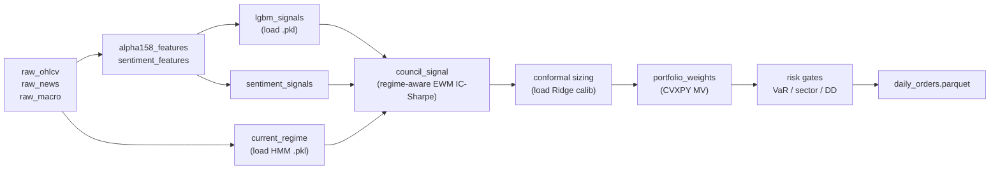
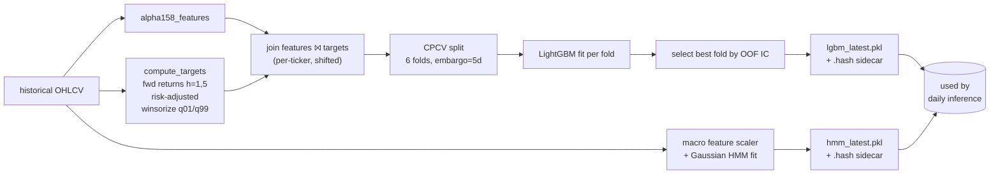

# Data Flow — Daily Inference vs Offline Training

Closes drift item **M8** by drawing a hard line between (a) the daily Dagster
inference pipeline (no targets, no labels, just signal generation and
optimisation) and (b) the offline training/backtesting flow that *does*
compute forward-looking targets via `data/features/target.py`.

## Daily inference (Dagster, 21:30 ET)

The daily pipeline only loads checkpoints and runs forward inference. It
**never** calls `compute_targets`. Forward returns belong to the training
regime where leakage can be controlled by purge/embargo.

Key invariants:

- All features in `alpha158_features` are produced with `shift(1)` so feature[T]
  only uses data available at the close of T-1.
- No element of `target.py` is invoked.
- Model checkpoints are loaded via `council.pickle_security.trusted_pickle_load`
  with mandatory SHA-256 sidecars.

## Offline training and backtesting

The training/backtesting flow lives in `scripts/run_strategy_backtest.py`,
`backtest/runner.py`, and dedicated retrain scripts. It computes labels
through `data/features/target.py`, applies CPCV with purging+embargo, and
retrains the models that produce the checkpoints consumed by the daily flow.

Key invariants:

- `compute_targets(horizons=[1, 5])` is invoked **only** in training/backtest
  scripts, never from a Dagster daily asset.
- Purging removes overlapping forward-return windows; embargo of 5 days
  removes additional samples adjacent to each test fold.
- Selection metric is OOF IC (Spearman cross-section).
- Each checkpoint is written with `write_pickle_hash_sidecar()` so daily
  inference can fail closed on a missing or mismatched sidecar.

## Why this matters

Earlier docs implied that target engineering ran in the daily path, which
would either (a) leak forward returns into inference or (b) waste
computation on labels nobody consumes. Keeping the two flows visually
distinct ensures that any new feature/model work is explicit about which
side of the line it touches.
