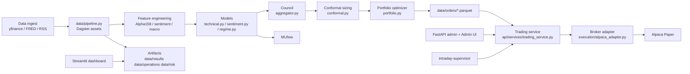

# Analisi tecnica del repository MLCouncil

## Assunzioni

Questa analisi è una **review statica** del codice e della configurazione del repository ospitato su entity["company","GitHub","developer platform"]. Non ho eseguito il sistema né validato dipendenze, broker, pipeline Dagster, UI o integrazioni di rete in runtime; le conclusioni sono quindi basate su codice, configurazioni CI/CD, documentazione interna e test presenti nel repository. Il branch analizzato è quello referenziato dai file recuperati dal connettore, coerente con `master` nelle pipeline CI e nei path usati dal repository. fileciteturn53file0 fileciteturn50file0

Assumo inoltre che l’obiettivo attuale del progetto sia **paper trading** su equities USA con supporto crypto in evoluzione, come dichiarato nel README e nelle configurazioni runtime. L’ambiente di deploy target, oltre allo stack locale `docker-compose`, **non è ulteriormente specificato**; live trading e Kubernetes sono esplicitamente fuori scope. Gli standard di codifica formali **non risultano specificati** in un documento dedicato: esistono però gate incrementali di lint, type checking e security nei workflow CI e nel PR template. fileciteturn50file0 fileciteturn54file0 fileciteturn53file0 fileciteturn37file0

## Sintesi esecutiva

Il repository è **ambizioso, relativamente maturo sul piano della struttura**, e già dotato di elementi importanti per un sistema operativo serio: orchestrazione Dagster, separazione tra control plane FastAPI e dashboard Streamlit, controlli runtime, test numerosi, security scans in CI, manifest di artifact, e una forte enfasi su lineage, risk controls e paper-trading safety. La documentazione operativa è migliore della media per un progetto personale/PoC. fileciteturn31file0 fileciteturn20file0 fileciteturn54file0 fileciteturn53file0 fileciteturn40file0

Detto questo, il codice presenta **alcuni difetti ad alta priorità** che incidono su correttezza operativa e sicurezza. Il più grave è nell’adapter broker: in `execution/alpaca_adapter.py`, `_api_auth_headers()` seleziona sempre prima le credenziali paper (`paper_key` / `paper_secret`) anche quando il nodo è in modalità live, creando un rischio concreto di autenticazione errata verso endpoint live. Un secondo problema forte è il flusso intraday: `_orders_from_intraday_decision()` assegna `target_weight=0.0` di default, mentre `_risk_adjust_intraday_orders()` scarta i buy order con `target_weight <= 0`, per cui intent intraday notional-based senza `target_weight` esplicito possono essere **silenziosamente eliminati**. Terzo, la UI admin salva la API key in `localStorage`, aumentando la superficie di esfiltrazione in caso di XSS o browser condiviso. fileciteturn32file0 fileciteturn23file0 fileciteturn47file0

Il secondo gruppo di problemi è di **drift architetturale**: il README descrive un ensemble a tre modelli, ma il path reale `council_signal` passa all’aggregator solo `lgbm` e `sentiment`; l’HMM è usato come etichetta di regime, non come alpha signal. Analogamente, la pipeline giornaliera usa per il sentiment una media semplice dei headline scores, bypassando molta della logica più ricca già implementata in `models/sentiment.py` per decadenza temporale e source weighting. Anche la narrativa “tutte le feature write sono versionate in ArcticDB” non è pienamente allineata al flusso effettivo della pipeline giornaliera, che scrive soprattutto parquet su filesystem. Questo non rende il progetto inutile; significa però che documentazione, design intent e implementazione reale si stanno separando. fileciteturn31file0 fileciteturn25file0 fileciteturn29file0 fileciteturn50file0 fileciteturn51file0 fileciteturn52file0

Sul fronte qualità, la suite test è ampia e copre molte superfici, ma la **soglia coverage di CI è ancora bassa** (`68%`) e lint/typecheck sono limitati a pochi moduli critici. Inoltre la CI gira su Python 3.13, mentre il Docker runtime usa Python 3.10: questa divergenza può mascherare incompatibilità e comportamenti differenti tra CI e produzione locale. Mancano anche test end-to-end realistici su percorso “generate orders → preflight → execute”, test di regressione prestazionale, scansioni container/image e una strategia di typed errors meno dipendente da `except Exception`. fileciteturn53file0 fileciteturn17file0 fileciteturn59file0 fileciteturn35file0 fileciteturn36file0

La conclusione pratica è netta: **MLCouncil è una buona base tecnica da hardenare**, non ancora una base da considerare “production-like” senza una fase di refactor e allineamento. La priorità non è aggiungere nuove feature; è ridurre il rischio operativo e rendere coerenti control plane, execution path, documentazione e pipeline. fileciteturn38file0 fileciteturn40file0

## Mappa architetturale e dipendenze

L’architettura effettiva emersa dal repository è quella di un sistema batch-first con orchestrazione Dagster, superfici di servizio e osservabilità separate, persistenza principalmente su filesystem/parquet, integrazione broker con entity["company","Alpaca","broker api provider"], e strati ML distinti per technical model, sentiment, regime, ensemble, sizing e portfolio optimization. `workspace.yaml` carica `data/pipeline.py`; `docker-compose.yml` espone admin API, dashboard, Dagster, MLflow e `intraday-supervisor`; il README descrive il target di paper trading e i principali stage. fileciteturn18file0 fileciteturn54file0 fileciteturn50file0



### Mappa dei componenti principali

| Componente | File chiave | Responsabilità | Osservazioni |
|---|---|---|---|
| Orchestrazione batch | `data/pipeline.py`, `workspace.yaml` | Dagster assets, schedules, checks, lineage, ordini giornalieri | Cuore operativo del sistema; molto codice in un solo file, quindi alta accoppiatura. fileciteturn31file0 fileciteturn18file0 |
| Modello tecnico | `models/technical.py` | LightGBM con CPCV, SHAP, prediction z-scored | Implementazione ricca, ma la daily pipeline fa inference da checkpoint, non training. fileciteturn28file0 fileciteturn31file0 |
| Sentiment | `models/sentiment.py` | FinBERT, cache SQLite, weighting per sorgente/recency | La pipeline giornaliera non usa tutta questa logica: usa una media semplice dei punteggi headline. fileciteturn29file0 fileciteturn31file0 |
| Regime | `models/regime.py` | HMM/GMM fallback, label bull/bear/transition, checkpointing | Training HMM separato in job dedicato. fileciteturn30file0 fileciteturn31file0 |
| Ensemble | `council/aggregator.py` | Pesatura per regime, adaptive weighting, orthogonality monitor | Configurato per 3 modelli, ma il path reale giornaliero ne usa 2. fileciteturn25file0 fileciteturn31file0 |
| Sizing/allocazione | `council/conformal.py`, `council/portfolio.py` | MAPIE sizing + CVXPY optimizer + order generation | Strato concettualmente buono, ma con costi computazionali crescenti. fileciteturn27file0 fileciteturn26file0 |
| Execution | `api/services/trading_service.py`, `execution/alpaca_adapter.py` | Preflight, risk checks, submit order, trade log, reconciliation | Area più sensibile e con i bug più critici trovati. fileciteturn23file0 fileciteturn32file0 |
| API / control plane | `api/main.py`, `api/auth.py`, `api/routers/*.py` | Auth, rate limiting, health, pipeline controls, trading endpoints | Design pragmatico; alcuni endpoint informativi sono pubblici. fileciteturn20file0 fileciteturn21file0 fileciteturn45file0 fileciteturn46file0 |
| UI / osservabilità | `api/static/js/admin.js`, dashboard Streamlit, `council/alerts.py` | Admin UI, alerting, visual monitoring | UX utile ma con alcune scelte di sicurezza e correttezza da rivedere. fileciteturn47file0 fileciteturn39file0 fileciteturn50file0 |

### Elenco dipendenze principali

| Area | Dipendenze principali | Fonte | Note tecniche |
|---|---|---|---|
| Data / analisi | `pandas`, `polars`, `numpy`, `scipy`, `yfinance`, `feedparser` | `requirements.txt` fileciteturn55file0 | Stack misto pandas/polars potente ma aumenta conversioni e complessità. |
| ML / factor modeling | `lightgbm`, `shap`, `hmmlearn`, `mapie`, `scikit-learn` | `requirements.txt`, `requirements_api.txt` fileciteturn55file0 fileciteturn56file0 | Coerente con il design, ma costoso in cold start. |
| Optimizer / monitoring | `cvxpy`, `evidently`, `mlflow` | `requirements.txt` fileciteturn55file0 | `cvxpy` è corretto per il PoC ma non economico su run frequenti. |
| Orchestrazione | `dagster`, `dagster-graphql`, `dagster-webserver` | `requirements.txt` fileciteturn55file0 | Forte centralità di `data/pipeline.py`. |
| API / UI | `fastapi`, `uvicorn`, `jinja2`, `slowapi`, `streamlit`, `plotly` | `requirements.txt`, `requirements_api.txt` fileciteturn55file0 fileciteturn56file0 | Separazione API/admin e dashboard corretta. |
| Broker / rete | `alpaca-py`, `requests`, `httpx` | `requirements_api.txt` fileciteturn56file0 | Uso misto SDK + HTTP raw: pragmatico, ma da consolidare. |
| Config / runtime | `pyyaml`, `python-dotenv`, `loguru` | `requirements.txt`, `requirements_api.txt` fileciteturn55file0 fileciteturn56file0 | `runtime_env.py` è già una buona base di hardening. |
| Quality gates | `pytest-cov`, `ruff`, `mypy`, `pip-audit`, `bandit` | `requirements_ci.txt` fileciteturn58file0 | Positivo; scope ancora incrementale e non full-repo. |

La strategia di versioning delle dipendenze è **ibrida**: `requirements.txt` usa lower bounds, esiste un `requirements_lock.txt` con snapshot pinned, e la CI installa `requirements.txt` + `requirements_ci.txt`. Questo è meglio di nulla, ma lascia spazio a drift tra runtime, CI e lockfile, soprattutto insieme al mismatch Python 3.10/3.13. fileciteturn55file0 fileciteturn57file0 fileciteturn53file0 fileciteturn17file0 fileciteturn59file0

## Analisi statica del codice

Il connettore GitHub usato per questa review non espone sempre line number granulari in modo affidabile; per questo motivo riporto **file e funzione/metodo** come riferimento operativo. Dove il problema è architetturale, indico anche il path che dimostra il comportamento. fileciteturn23file0 fileciteturn31file0

| Priorità | File / riferimento | Categoria | Problema | Impatto | Evidenza |
|---|---|---|---|---|---|
| **Critica** | `execution/alpaca_adapter.py` → `_api_auth_headers()` | Bug / sicurezza | Le intestazioni API scelgono `paper_key` / `paper_secret` con precedenza anche in modalità live (`paper_key or live_key`), creando una selezione credenziali errata. | In un deploy live con entrambe le coppie presenti, le richieste HTTP raw possono autenticarsi con credenziali sbagliate verso endpoint live. | fileciteturn32file0 |
| **Alta** | `api/services/trading_service.py` → `_orders_from_intraday_decision()`, `_risk_adjust_intraday_orders()` | Bug funzionale | Gli ordini intraday buy senza `target_weight` esplicito vengono inizializzati con `target_weight=0.0`; il risk adjust poi scarta i buy con `target_weight <= 0.0`. | Intent intraday notional-based possono sparire silenziosamente, alterando la strategia e rendendo difficile il debugging. | fileciteturn23file0 |
| **Alta** | `api/static/js/admin.js` → `getApiKey()`, `setApiKey()` | Sicurezza | La chiave admin API viene salvata in `localStorage`. | Qualunque XSS o uso del browser condiviso espone il token amministrativo. | fileciteturn47file0 |
| **Alta** | `data/pipeline.py` → `save_regime_results()`; `models/regime.py` → `save()/load()` | Sicurezza / integrità artifact | In `save_regime_results()` il checkpoint HMM viene caricato con `pickle.load` diretto, bypassando `_safe_pickle_load()` e il sidecar hash usato altrove. | Integrità del checkpoint non garantita in un path operativo reale; rischio di esecuzione di pickle manomessi. | fileciteturn31file0 fileciteturn30file0 |
| **Alta** | `council/aggregator.py` + `data/pipeline.py::council_signal` + README | Bug architetturale | L’aggregator è configurato con pesi per `lgbm`, `sentiment`, `hmm`, ma il path giornaliero passa solo `lgbm_signals` e `sentiment_signals`; l’HMM agisce solo come regime label. | Il sistema reale è di fatto un **2-model ensemble**, non il 3-model ensemble descritto nella documentazione. | fileciteturn25file0 fileciteturn31file0 fileciteturn50file0 |
| **Media-alta** | `data/pipeline.py::sentiment_features` vs `models/sentiment.py::predict` | Drift implementativo | La pipeline giornaliera calcola il sentiment come media semplice degli headline scores per ticker, bypassando source weighting, recency decay e logica di aggregazione del modello dedicato. | Il comportamento live della pipeline diverge dal modello implementato e documentato. | fileciteturn31file0 fileciteturn29file0 |
| **Media** | `council/aggregator.py` → `compute_correlation_matrix()` | Bug logico | Le colonne del dataframe combinato vengono rinominate con `models[:len(series_list)]`, anche se qualche modello richiesto non ha history sufficiente. | Possibili mislabel nelle correlazioni, nelle penalità di orthogonality e nei report/alert. | fileciteturn25file0 |
| **Media** | `api/static/js/admin.js::loadPendingOrders()` vs `council/portfolio.py::compute_orders()` | Bug UI / correttezza | La UI mostra il valore ordine come `quantity * price`, ma `compute_orders()` definisce `quantity` come importo USD, non come numero di azioni; spesso `price` non c’è proprio. | Pending orders mostrati a `$0` o con notional errati. | fileciteturn47file0 fileciteturn26file0 |
| **Media** | `api/auth.py`, `api/main.py`, `api/routers/health.py` | Sicurezza / info disclosure | `/api/health`, `/api/docs` e `/api/openapi.json` sono pubblici; `health` espone runtime profile, config hash, validation summary e stato operations. | In deploy non strettamente localhost, aumenta la superficie di leakage operativo. | fileciteturn21file0 fileciteturn20file0 fileciteturn46file0 |
| **Media** | `data/pipeline.py::alpha158_features`, `_compute_covariance()`, `_load_historical_returns()` in `trading_service.py` | Performance / scalabilità | Vari step rileggono tutta la storia OHLCV o molti parquet a ogni run/preflight per rolling windows, covarianza e rischio. | Costi I/O e CPU crescenti con lo storico; peggioramento lineare della latenza. | fileciteturn31file0 fileciteturn23file0 |
| **Media** | `api/main.py`, `api/services/trading_service.py`, `execution/alpaca_adapter.py`, `data/pipeline.py` | Maintainability / diagnosi errori | Uso esteso di `except Exception` o catch-all con fallback silenziosi. | Errori reali vengono assorbiti e trasformati in “degraded”, “0.0”, o ritorni vuoti, riducendo osservabilità e affidabilità. | fileciteturn20file0 fileciteturn23file0 fileciteturn32file0 fileciteturn31file0 |
| **Media** | `Dockerfile`, `.github/workflows/ci.yml`, `mypy.ini` | CI/runtime mismatch | Runtime Docker su Python 3.10, CI e typechecking su Python 3.13. | Possibili sorprese su typing, dependency resolution e comportamento runtime. | fileciteturn17file0 fileciteturn53file0 fileciteturn59file0 |
| **Bassa-media** | `api/main.py`, `council/alerts.py`, `docs/fase4-hardening.md` | Debito tecnico / deprecazioni | Persistono `@app.on_event("startup")` e uso di `datetime.utcnow()`, già annotati come limite noto nel repo. | Non bloccante oggi, ma da rimuovere per compatibilità futura e pulizia architetturale. | fileciteturn20file0 fileciteturn39file0 fileciteturn38file0 |
| **Bassa-media** | `council/alerts.py::retry_deadletter()` | Bug di affidabilità | `retry_deadletter()` incrementa `sent` dopo `_send_email(alert)` anche se `_send_email` fallisce e re-accoda l’alert. | Metriche di resend false-positive; osservabilità degradată. | fileciteturn39file0 |

### Correzioni critiche suggerite

Le tre modifiche qui sotto sono, a mio giudizio, le prime da applicare.

**Correzione del selettore credenziali broker**

```diff
diff --git a/execution/alpaca_adapter.py b/execution/alpaca_adapter.py
@@
     def _api_auth_headers(self, include_json: bool = False) -> dict[str, str]:
-        api_key = self.config.paper_key or self.config.live_key or ""
-        api_secret = self.config.paper_secret or self.config.live_secret or ""
+        if self.config.mode == TradingMode.LIVE:
+            api_key = self.config.live_key or ""
+            api_secret = self.config.live_secret or ""
+        else:
+            api_key = self.config.paper_key or ""
+            api_secret = self.config.paper_secret or ""
         headers = {
             "APCA-API-KEY-ID": api_key,
             "APCA-API-SECRET-KEY": api_secret,
         }
```

**Correzione del path intraday per ordini notional-based senza `target_weight`**

```diff
diff --git a/api/services/trading_service.py b/api/services/trading_service.py
@@
     def _orders_from_intraday_decision(self, decision: dict[str, Any]) -> list[dict[str, Any]]:
@@
-            orders.append(
-                {
-                    "ticker": ticker,
-                    "direction": side,
-                    "quantity": quantity_notional,
-                    "share_quantity": share_quantity,
-                    "target_weight": float(intent.get("target_weight", 0.0) or 0.0),
-                    "price": estimated_price,
-                    "decision_id": decision.get("decision_id"),
-                    "strategy_version": decision.get("strategy_version", "intraday-v1"),
-                }
-            )
+            order = {
+                "ticker": ticker,
+                "direction": side,
+                "quantity": quantity_notional,
+                "share_quantity": share_quantity,
+                "price": estimated_price,
+                "decision_id": decision.get("decision_id"),
+                "strategy_version": decision.get("strategy_version", "intraday-v1"),
+            }
+            if intent.get("target_weight") is not None:
+                order["target_weight"] = float(intent["target_weight"])
+            orders.append(order)
@@
-            target_weight = float(order.get("target_weight", 0.0) or 0.0)
+            raw_target_weight = order.get("target_weight")
             requested_notional = float(order.get("quantity", 0.0) or 0.0)
+            target_weight = (
+                float(raw_target_weight)
+                if raw_target_weight is not None
+                else (requested_notional / portfolio_value if portfolio_value > 0 else 0.0)
+            )
@@
-            if target_weight <= 0.0 or requested_notional <= 0.0:
+            if requested_notional <= 0.0 or target_weight <= 0.0:
                 continue
```

**Uniformare il caricamento sicuro dei checkpoint**

```diff
diff --git a/data/pipeline.py b/data/pipeline.py
@@
-                import pickle as pickle_mod
-                with open(checkpoint, "rb") as f:
-                    regime_model: RegimeModel = pickle_mod.load(f)
+                regime_model: RegimeModel = _safe_pickle_load(checkpoint)
                 prob_dict = regime_model.predict_probabilities(raw_macro)
@@
-                import pickle as pickle_mod
-                with open(checkpoint, "rb") as f:
-                    regime_model: RegimeModel = pickle_mod.load(f)
+                regime_model: RegimeModel = _safe_pickle_load(checkpoint)
                 hist_df = regime_model.get_regime_history(raw_macro)
```

**Correzione minima di sicurezza lato UI**

```diff
diff --git a/api/static/js/admin.js b/api/static/js/admin.js
@@
 function getApiKey() {
-    return localStorage.getItem('mlcouncil_api_key') || '';
+    return sessionStorage.getItem('mlcouncil_api_key') || '';
 }
@@
 function setApiKey(value) {
     const apiKey = (value || '').trim();
     if (apiKey) {
-        localStorage.setItem('mlcouncil_api_key', apiKey);
+        sessionStorage.setItem('mlcouncil_api_key', apiKey);
     } else {
-        localStorage.removeItem('mlcouncil_api_key');
+        sessionStorage.removeItem('mlcouncil_api_key');
     }
 }
```

## Test, copertura e CI/CD

La qualità dei test è **buona in ampiezza**: il repository contiene suite dedicate a pipeline, council, adapter broker, runtime env, API health/trading/pipeline/portfolio/monitoring, intraday runtime, dashboard, artifact governance e backtest/validation. La CI esegue pytest con coverage gate, smoke import Dagster, lint con Ruff, mypy incrementale, `pip-audit`, Bandit e build Docker. Questo è un impianto di qualità superiore alla media dei repository simili. fileciteturn35file0 fileciteturn36file0 fileciteturn34file0 fileciteturn53file0

Il limite principale è che la **coverage reale non è riportata** nel repository analizzato: è noto solo il gate minimo (`--cov-fail-under=68`). Inoltre il lint e il typecheck non sono full-repo, ma limitati a un sottoinsieme di moduli “critici”; la documentazione del repo lo riconosce esplicitamente come approccio incrementale. Non c’è evidenza, nella CI osservata, di matrix Python, test end-to-end con servizi compose, container scanning, SARIF upload o deploy automation. fileciteturn53file0 fileciteturn38file0 fileciteturn37file0

### Valutazione sintetica

| Aspetto | Stato | Giudizio | Evidenza |
|---|---|---|---|
| Suite unit/integration-lite | Presente e ampia | **Buona** | `tests/test_pipeline.py`, `tests/test_council.py`, `tests/test_alpaca_adapter.py`, numerose suite API/intraday/dashboard. fileciteturn35file0 fileciteturn36file0 fileciteturn34file0 fileciteturn33file44 fileciteturn33file69 |
| Coverage gate | Presente ma basso | **Sufficiente, non ancora forte** | `--cov-fail-under=68`. fileciteturn53file0 |
| Lint | Presente, scope limitato | **Medio** | Ruff solo su 5 moduli. fileciteturn53file0 |
| Type checking | Presente, scope limitato | **Medio** | Mypy incrementale su pochi file, `ignore_missing_imports = True`. fileciteturn53file0 fileciteturn59file0 |
| Security scanning | Presente | **Buono** | Secret scan, `pip-audit`, Bandit. fileciteturn53file0 |
| Build validation | Presente | **Buono** | Build Docker in CI. fileciteturn53file0 |
| CD / release automation | Non rilevata | **Debole / assente** | Nessuno stage di release o deploy nel workflow esaminato. fileciteturn53file0 |
| Runtime/CI parity | Incoerente | **Problematica** | CI/typecheck su 3.13, runtime Docker su 3.10. fileciteturn53file0 fileciteturn17file0 fileciteturn59file0 |

### Test da aggiungere

| Modulo | Test mancante | Perché è importante |
|---|---|---|
| `execution/alpaca_adapter.py` | Test live-mode su `_api_auth_headers()` con paper+live keys entrambe presenti | Previene il bug più critico trovato. |
| `api/services/trading_service.py` | Test intraday con buy intent notional-based e `target_weight` assente | Copre il bug di drop silenzioso degli ordini. |
| `data/pipeline.py` | Test che `save_regime_results()` rifiuti checkpoint con hash mismatch | Allinea il percorso operativo alla policy di integrità checkpoint. |
| `council/aggregator.py` | Test orthogonality con history mancante per un modello intermedio | Copre il mislabel delle colonne nel calcolo correlazioni. |
| `api/static/js/admin.js` | Test JS per rendering pending orders con `quantity` già in USD | Evita regressioni di UX fuorviante. |
| `api/routers/health.py` / auth | Test di configurazione per health/docs pubblici vs protetti | Utile se si introduce una policy configurabile di esposizione. |
| End-to-end mocked | Pipeline → `daily_orders` → preflight → execute con fake broker | Validazione del percorso più critico di business. |
| Performance | Benchmark `_compute_covariance()` e `alpha158_features()` su storico crescente | Serve a misurare quando la pipeline smette di scalare. |

### Modifiche CI consigliate

| Modifica | Effetto atteso |
|---|---|
| Matrix `python-version: [3.10, 3.13]` | Riduce il gap runtime/CI. |
| Upload JUnit + coverage XML come artifact | Migliora osservabilità dei fallimenti. |
| Alzare gradualmente `cov-fail-under` a 72 → 78 → 85 | Spinge la suite verso copertura più affidabile. |
| Estendere Ruff/Mypy a package progressivi, non a file singoli | Riduce il debito tecnico diffuso. |
| Aggiungere scan immagine Docker | Copre il rischio supply-chain a livello container. |
| Inserire job di benchmark sintetico | Evita regressioni prestazionali invisibili al unit testing. |

## Performance, scalabilità e onboarding

I principali colli di bottiglia derivano da un pattern ricorrente: **scan completo dello storico su filesystem a ogni run**. `alpha158_features` rilegge tutto l’OHLCV disponibile per calcolare le rolling windows; `_compute_covariance()` rilegge parquet per ogni ticker e ricostruisce la covarianza recente; `_load_historical_returns()` nel trading service rilegge storici OHLCV per il rischio pre-trade. Questa scelta è semplice e robusta nel PoC, ma non scala bene con l’allungarsi della storia o con l’aumento dell’universo. fileciteturn31file0 fileciteturn23file0

Anche il percorso sentiment ha un costo non banale: il modello FinBERT è lazy-loaded e la pipeline cerca di batchare gli headline, ma il cold-start del transformer e il costo di scoring possono diventare significativi se aumenta il volume news. La cache aiuta, ma attualmente la pipeline giornaliera ricrea `SentimentModel()` e non appare progettata come servizio di inferenza riusabile o job separato con warm state. fileciteturn29file0 fileciteturn31file0

Sul piano onboarding/documentazione, il progetto è forte in runbook e phase docs, ma presenta **drift tra README e codice reale**. Il README parla di stage di “Model Training / Refresh” nella daily pipeline e di un ensemble a tre modelli; la pipeline reale fa soprattutto inference da checkpoint e combina solo due segnali. Il README suggerisce inoltre una narrativa centrata su ArcticDB per point-in-time correctness, ma nella pipeline osservata le write giornaliere sono quasi tutte parquet su filesystem, mentre `FeatureStore` compare nei path ispezionati solo nella health check e nei test. Anche la quick start è leggermente confusa: `requirements.txt` include già `requirements_api.txt`, ma il README chiede comunque di installarlo separatamente. fileciteturn50file0 fileciteturn31file0 fileciteturn51file0 fileciteturn52file0 fileciteturn55file0

### Principali concern di performance e onboarding

| Area | Osservazione | Impatto | Evidenza |
|---|---|---|---|
| Feature engineering | `alpha158_features` carica tutta la storia OHLCV a ogni run | Tempo batch crescente con storico | fileciteturn31file0 |
| Risk / covariance | `_compute_covariance()` e `_load_historical_returns()` rileggono parquet storici | I/O e CPU evitabili | fileciteturn31file0 fileciteturn23file0 |
| Sentiment | Lazy transformer + scoring batch per giornata | Cold-start e variabilità latenza | fileciteturn29file0 fileciteturn31file0 |
| Architecture drift | README ≠ pipeline reale su training/ensemble/storage | Onboarding più difficile, aspettative sbagliate | fileciteturn50file0 fileciteturn31file0 fileciteturn51file0 |
| Install flow | README installa `requirements_api.txt` dopo `requirements.txt`, che già lo include | Ridondanza e confusione | fileciteturn50file0 fileciteturn55file0 |
| Coding standards | Nessuna policy formale osservata, solo gate incrementali | Review meno uniforme | fileciteturn37file0 fileciteturn53file0 |

## Raccomandazioni prioritarie

### Piano d’azione

| Orizzonte | Raccomandazione | Effort | Rischio di change | Valore atteso |
|---|---|---:|---:|---|
| **Breve termine** | Correggere la selezione credenziali in `AlpacaLiveNode` | S | Basso | Elimina il bug più critico lato broker. |
| **Breve termine** | Correggere la semantica intraday per ordini notional-based senza `target_weight` | M | Medio | Impedisce drop silenziosi di segnali e sizing errato. |
| **Breve termine** | Spostare API key UI da `localStorage` a `sessionStorage` o memoria volatile | S | Basso | Riduce il rischio di esfiltrazione. |
| **Breve termine** | Uniformare tutti i load di checkpoint su `_safe_pickle_load()` o equivalente | S | Basso | Coerenza security sugli artifact. |
| **Breve termine** | Decidere se `health/docs/openapi` devono restare pubblici e renderlo configurabile | S | Basso | Chiarezza di posture security. |
| **Breve termine** | Aggiungere test mirati per i bug sopra e alzare coverage floor almeno a 72–75 | M | Basso | Rende i fix non regressibili. |
| **Medio termine** | Allineare README/diagrammi alla realtà o completare la realtà al README | M | Basso | Riduce il drift concettuale. |
| **Medio termine** | Rifattorizzare `data/pipeline.py` in moduli per ingest/features/signals/execution | L | Medio | Diminuisce accoppiamento e facilita test/typecheck full-repo. |
| **Medio termine** | Introdurre cache incrementali per covariance, returns e feature windows | M/L | Medio | Riduce latenza batch e costo I/O. |
| **Medio termine** | Unificare policy Python runtime/CI su una sola versione supportata | S | Basso | Migliora reproducibility. |
| **Lungo termine** | Centralizzare config, artifact I/O e broker access in servizi typed con domain errors | L | Medio | Meno `except Exception`, più diagnosi e manutenibilità. |
| **Lungo termine** | Passare a configurazione tool centralizzata (`pyproject.toml`) e lock riproducibile (`pip-tools` o `uv`) | M | Basso | Migliora disciplina del repo e parity ambienti. |
| **Lungo termine** | Aggiungere E2E paper-trading sandbox e benchmark prestazionali continui | L | Medio | Avvicina il progetto a standard production-like. |

### Refactor strutturali consigliati

Il refactor con miglior rapporto valore/costo è separare l’attuale monolite `data/pipeline.py` in quattro moduli: `ingest_assets.py`, `feature_assets.py`, `signal_assets.py`, `execution_assets.py`, lasciando in `pipeline.py` solo definizioni, jobs e schedules. Questo ridurrebbe subito il costo cognitivo, la superficie dei conflict merge, e renderebbe più naturale estendere Ruff/Mypy a livello package. fileciteturn31file0

Propongo inoltre di introdurre tre boundary espliciti: un `BrokerClient` unico per SDK+HTTP Alpaca, un `ArtifactRepository` per parquet/json/pickle-manifest/hash, e un `Settings` layer typed che incapsuli `runtime_env.py` verso le API e la pipeline. Oggi le stesse responsabilità appaiono replicate in più path: ad esempio load/safe-load di checkpoint, manipolazioni di artifact json/parquet, interpretazione di variabili ambiente e conversione di ordini/notional/shares. fileciteturn19file0 fileciteturn23file0 fileciteturn31file0 fileciteturn32file0

### Tooling, linters e security fix suggeriti

L’attuale set `ruff + mypy + pip-audit + bandit` è corretto come base. Farei però tre passi: centralizzare la configurazione tooling in `pyproject.toml`, estendere progressivamente il typecheck a package interi anziché file specifici, e aggiungere uno scanner immagine/container. In locale introdurrei anche un `pre-commit` che esegua almeno Ruff, secret scan e test fast sui moduli toccati. Queste proposte sono coerenti con la traiettoria già presente nel PR template e nella CI. fileciteturn37file0 fileciteturn53file0

Sul piano security, le priorità sono: eliminare persistenza lunga del token admin sul browser; limitare la visibilità degli endpoint informativi in ambienti diversi dal localhost; rimuovere ogni `pickle.load` non protetto; e valutare un formato di serializzazione più sicuro per artifact non strettamente Python-specific. Il fatto che il repository abbia già manifest e hash sidecar in alcuni percorsi indica che un rafforzamento coerente è realisticamente fattibile senza stravolgere il progetto. fileciteturn47file0 fileciteturn46file0 fileciteturn31file0 fileciteturn30file0 fileciteturn41file0

### Metriche da monitorare

| Categoria | Metrica | Perché monitorarla |
|---|---|---|
| Data ops | `data_freshness.days_ago` | Già esposta dalla health; è la prima misura di pipeline lag. |
| Execution ops | `orders_rejected / orders_submitted`, `trade_status`, `pretrade.blocked` | Misurano direttamente degradazione operativa e qualità dei segnali/ordini. |
| Broker | count di HTTP 429, retry count, auth failures | Serve a capire stabilità e posture del path Alpaca. |
| Performance batch | durata `alpha158_features`, durata `_compute_covariance`, durata preflight | Individua il punto esatto dove lo scaling smette di reggere. |
| Sentiment | cache hit ratio, headlines scored per run, cold-start time | Determina il costo reale di FinBERT. |
| Quality engineering | coverage %, moduli sotto lint/typecheck, tempo CI | Misura la maturità del repository, non solo il prodotto. |
| Model governance | `oos_sharpe`, `pbo`, `walk_forward_window_count`, `regime_count` | Sono già allineate ai promotion criteria del progetto. |
| Security posture | failed secret scans, findings Bandit/pip-audit per release | Consente una baseline di hardening evolutivo. |

Il repository possiede già alcune superfici utili da cui partire: la health espone freshness/runtime/operations/validation summary; il trading service contabilizza rejected orders e reconciliation; gli alert operativi hanno strutture dati formali; i promotion criteria già elencano metriche model-governance. Conviene quindi **non inventare un nuovo modello osservabilità**, ma far convergere questi segnali in una dashboard/MLflow/metrics sink coerente. fileciteturn46file0 fileciteturn23file0 fileciteturn39file0 fileciteturn41file0

## Questioni aperte e limiti

Rimangono alcune incertezze che non sono specificate nel repository esaminato. Non è definito in modo rigoroso un ambiente di deploy diverso dal Compose locale; non è visibile una policy ufficiale di release/versioning semantico; non è chiaro se il path intraday in produzione reale usi sempre `target_weight` oppure anche intent puramente notional-based; non è disponibile, nel materiale analizzato, il valore di coverage corrente effettivo né una misura storica delle latenze batch/runtime. Queste lacune non invalidano le conclusioni principali, ma influenzano la priorità relativa di alcuni refactor. fileciteturn50file0 fileciteturn54file0 fileciteturn53file0 fileciteturn23file0

Nel complesso, il progetto merita di essere trattato come una base **molto promettente ma ancora in fase di hardening**. Se dovessi scegliere una sequenza unica, farei così: **broker auth fix → intraday order semantics → checkpoint loading hardening → token storage fix → README/code alignment → refactor incrementale di `data/pipeline.py` → performance caching**. Questa sequenza massimizza riduzione del rischio prima di introdurre nuove feature. fileciteturn32file0 fileciteturn23file0 fileciteturn31file0 fileciteturn47file0 fileciteturn50file0