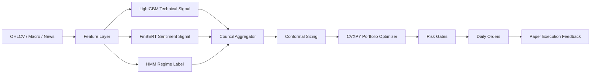

# Agentic Council Cockpit Design

## Status

Draft for review.

## Goal

Build a read-only custom React dashboard that runs alongside the existing Streamlit dashboard and presents MLCouncil as an inspectable AS IS computational system for a quant/operator.

The first version must help answer two questions:

1. What is the system doing today?
2. Why did the models and council produce this decision?

## Non-Goals

- Do not replace Streamlit in v1.
- Do not add trading actions in v1.
- Do not show future architecture, aspirational models, or unimplemented neural networks.
- Do not expose secrets, raw credentials, or unsafe admin controls.
- Do not make the frontend read parquet/json artifacts directly from disk.

## Product Direction

The dashboard is a **Neural Systems Map** of the real AS IS architecture. It should feel like a model cockpit rather than a generic BI dashboard.

The home screen is the system map. The daily operational view is a secondary tab.

The visual language should emphasize:

- computational nodes,
- data flow,
- model confidence,
- freshness,
- degradations,
- mathematical transformations,
- model-specific diagnostics,
- artifact traceability.

## Target User

Primary user: quant/operator.

This user wants dense, inspectable information and fast debugging paths. The dashboard should favor operational truth over marketing polish.

## Architecture

The new frontend should be added alongside the existing dashboard.

```text
FastAPI Admin API
+-- Existing admin HTML
+-- Existing Streamlit dashboard
+-- New React dashboard
    +-- System Map
    +-- Node Inspector
    +-- Daily Decision
    +-- Signal Debug
    +-- Math / Model views
    +-- Artifact audit views
```

FastAPI remains the data/control plane. The frontend consumes normalized dashboard payloads from dedicated read-only API endpoints.

## Recommended Stack

- Frontend: Next.js or Vite React.
- System map: React Flow.
- Charts: Plotly.js or Recharts.
- Tables: TanStack Table.
- Styling: Tailwind plus custom cockpit components.
- Backend: existing FastAPI app with new read-only dashboard routes.

If the repository does not already have a JavaScript package setup, start with a contained `frontend/` app so Python services and the React cockpit can evolve independently.

## AS IS System Map

The v1 map must show only real AS IS nodes:



Each node should show:

- status: healthy, stale, degraded, blocked, unavailable,
- latest output summary,
- freshness timestamp,
- confidence or uncertainty when available,
- artifact source,
- known caveat if the node has an AS IS mismatch or approximation.

## Navigation

### 1. System Map

Primary home.

Shows the clickable AS IS computational graph. Selecting a node updates the inspector.

Default selected node: `Council Aggregator`, because this is the highest-value entry point for daily decision review.

### 2. Daily Decision

Read-only review of the latest decision date.

Must include:

- current regime,
- active signals,
- effective council weights,
- top positive and negative signal names/tickers,
- conformal multiplier summary,
- target weights,
- risk gate status,
- generated daily orders,
- execution feedback if available.

### 3. Signal Debug

Model and signal diagnostics.

Sections:

- LightGBM technical signal: signal distribution, feature groups, top SHAP if available, IC trend.
- FinBERT sentiment signal: headline count, score distribution, source weighting status, cache/fallback status.
- HMM regime label: current state, state probabilities, transition history.
- Council aggregation: EWM IC-Sharpe, orthogonality penalty, effective weights, contribution traces.

### 4. Math / Model

Visual model explanations, not a static textbook.

This section should show block diagrams and formulas for the real implementation:

- feature alignment and one-day shift,
- LightGBM prediction to z-score,
- sentiment headline scoring and aggregation,
- HMM regime probability to label,
- council weighted score,
- EWM IC-Sharpe adjustment,
- orthogonality downweighting semantics,
- conformal multiplier mapping,
- CVXPY objective and constraints,
- VaR/CVaR and drawdown gates,
- transaction cost heuristic.

Every formula must display the actual parameter values used by the current code/config when available.

### 5. Artifacts

Audit/debug view.

Must include:

- latest artifact files by category,
- timestamp and freshness,
- manifest/hash status when available,
- missing artifacts,
- stale artifacts,
- degraded fallback notes.

## Inspector Design

The right inspector is persistent across the cockpit. It changes content based on the selected node.

Tabs inside inspector:

1. **Decision**
   - latest output,
   - status,
   - key metrics,
   - anomalies,
   - downstream impact.

2. **Model**
   - model type,
   - inputs,
   - output shape,
   - diagnostics,
   - confidence/uncertainty.

3. **Math**
   - formula,
   - parameter values,
   - simplifications/caveats,
   - links to code references or docs.

4. **Artifacts**
   - source files,
   - generated files,
   - freshness,
   - manifest/hash status.

## Read-Only API Contract

Add dedicated dashboard endpoints rather than forcing the frontend to compose low-level operational endpoints.

Proposed endpoints:

```text
GET /api/dashboard/system-map
GET /api/dashboard/daily-decision?date=YYYY-MM-DD
GET /api/dashboard/signal-debug?date=YYYY-MM-DD
GET /api/dashboard/node/{node_id}?date=YYYY-MM-DD
GET /api/dashboard/artifacts?date=YYYY-MM-DD
```

These endpoints should be read-only and should reuse existing artifact readers where possible.

They may aggregate data from:

- `data/results/`,
- `data/orders/`,
- `data/operations/`,
- `data/paper_trades/`,
- `data/risk/`,
- `config/`,
- existing health, portfolio, monitoring, trading service readers.

## Data Integrity Rules

- Missing data must be rendered as unavailable, not silently faked.
- Stale data must be visually distinct from fresh data.
- Fallback outputs must be labeled.
- The cockpit must not imply that HMM is an alpha signal unless the code changes to produce an HMM alpha signal.
- The cockpit must not display future models until they exist in code and have artifacts.

## Visual Principles

- Dense but legible.
- No marketing hero layout.
- No decorative chart cards with low information density.
- Use the system graph as the primary organizing surface.
- Use color for state and flow, not decoration.
- Prefer compact model blocks, flow arrows, badges, sparklines, and inspector panels.
- Make formulas visual and tied to live parameters.

## Migration Strategy

1. Keep Streamlit as legacy/fallback.
2. Add the read-only FastAPI dashboard API layer.
3. Add the custom React frontend alongside Streamlit.
4. Build System Map plus Inspector first.
5. Add Daily Decision.
6. Add Signal Debug.
7. Add Math / Model and Artifacts views.
8. Only after trust is established, consider replacing Streamlit or adding safe operational actions.

## Acceptance Criteria

- The React dashboard can be run locally without removing Streamlit.
- The home screen is the AS IS system map.
- Selecting a node updates the inspector.
- The default selected node is Council Aggregator.
- All displayed data comes from read-only API payloads.
- Missing/stale/fallback data is explicit.
- Daily Decision explains the latest available decision without allowing execution.
- Signal Debug shows at least LightGBM, FinBERT, HMM, and Council sections.
- Math / Model shows implementation-specific formulas and parameter values.
- No future/unimplemented architecture appears in the UI.

## Open Questions

- Use Next.js or Vite React for the first frontend app?
- Should the frontend be served separately in development, or bundled behind FastAPI for local use?
- Which artifacts are reliable enough today for the first `daily-decision` payload?
- Should the system map state be derived dynamically from artifacts or start as a static node registry enriched by live status?
